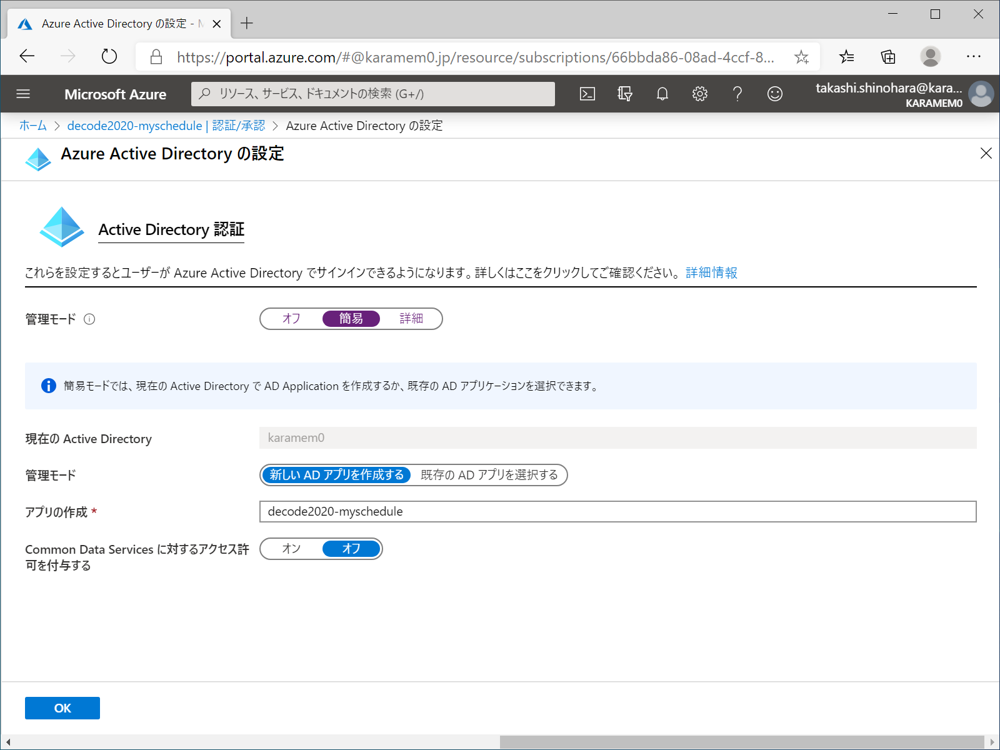

# de:code 2020 パーソナル スポンサー コード サンプル: Azure AD でセキュリティ保護された Web アプリケーションで Microsoft Graph を使用する

Azure App Service には Azure AD を使って Web アプリケーションを簡単に保護する機能が提供されています。この方法を使うと、本来は煩雑な OAuth フローもずっと簡単になるということをご存知でしたか? Azure AD で認証されたユーザーの資格情報を使って Microsoft Graph にアクセスする Web アプリケーションの構築についてその方法を説明します。

## 概要

Azure App Service ではノーコーディングで Web アプリケーションに対して認証機能を実装することができます。認証プロバイダーとしては Azure AD のほかに Facebook、Google、Twitter などがサポートされていますが、企業向けの Web アプリケーションでは、組織のデータへのアクセスを保護する目的で Azure AD で認証を行うことが多いと思います。Azure AD で認証を行う場合は Azure AD に登録されたアプリケーションに対して Open ID Connect による認証が行われます。ユーザーが Azure AD で保護された Web アプリケーションにログインすると、自動的に ID Token、Access Token、Refresh Token が発行されます。

Azure AD で保護された Web アプリケーションでは組織内の情報にアクセスするために Microsoft Graph を使うことがあります。Microsoft Graph へのアクセスは OAuth で行いますので、すでに取得した Access Token や Refresh Token があるのであれば、それを使って Microsoft Graph にアクセスできそうです。実際、Refresh Token を使って、Access Token の取り直しをすることで、同じ資格情報で Microsoft Graph にアクセスすることができます。

## サンプル コード

### 開発環境

- Visual Studio 2019
  - Azure App Service をデプロイするため \[Azure の開発\] のワークロードを有効にする必要があります。

### NuGet パッケージ

- Microsoft.Extensions.Configuration.EnvironmentVariables
  - 環境変数を読み込むためのライブラリです。ASP.NET Core アプリケーションではアプリケーションの設定情報はすべて環境変数として渡されます。これらの値を安全に読み込むために使用します。
- Microsoft.Graph
  - Microsoft Graph を実行するためのライブラリです。Microsoft Graph は RESTful なサービスなので、HTTP クライアントで直接呼び出して開発することもできますが、ライブラリを使用することで、開発生産性を高めることができます。
- Microsoft.Identity.Client
  - Microsoft Authentication Library (MSAL) と呼ばれるライブラリです。Azure AD に対して OAuth によるアクセス許可を行うために使用します。
- Microsoft.IdentityModel.JsonWebTokens
  - Json Web Token (JWT) を解析するためのライブラリです。Access Token の有効期間を判定するために使用します。

### 動作説明

アプリケーションから各種トークンを取得するために "/.auth/me" に対する GET リクエストを呼び出してレスポンスの JSON を受け取ります。ただし、いきなり HttpClient でリクエストを呼び出してもエラーになってしまいますので、自身が受け取った AppServiceAuthSession という名前の Cookie をリクエストに含めて要求する必要があります。これにより、現在の ID Token、Access Token、Refresh Token を取得できます。ちなみに各種トークンは有効期間がありますので、あらかじめ "/.auth/refresh" に対して POST リクエストを呼び出すことでトークンを更新しておきます。

取得した Access Token は Open ID Connect で発行されたものであり、Microsoft Graph へのアクセス許可は含まれていないので、Refresh Token を使って Microsoft Graph へのアクセス許可を含む Access Token を取得しなおします。Web アプリケーションへのリクエストごとにこの処理を行うのは無駄なので、Access Token はセッションに格納しておくようにします。また、セッションから取り出したときも Access Token の有効期間を確認し、有効期間が切れているようであれば Access Token の再取得を行います。

Access Token の取得フローを簡単にまとめてみます。

1. セッションに格納された Access Token を取得する。取得できない場合、または、Access Token の有効期限が切れている場合は次項を実行する。
2. "/.auth/refresh" を呼び出し各種トークンをリフレッシュする。
3. "/.auth/me" を呼び出し各種トークンを取得する。
4. 前項で取得した Refresh Token から Microsoft Graph に接続するための Access Token を取得する。
5. 取得した Access Token をセッションに格納する。

今回のサンプル アプリについては Microsoft Graph に対する Calendars.Read のアクセス許可を使用し、今後の予定を取得して表示するようになっています。実行すると、以下のようなページが表示されると思います。

## デプロイ手順

- [App Service の作成](#App-Service-の作成)
- [App Service のデプロイ](#App-Service-のデプロイ)
- [アクセス許可の追加](#アクセス許可の追加)

### App Service の作成

1. [Microsoft Azure Portal](https://portal.azure.com) にログインします。

1. \[リソースの作成\] - \[Web アプリ\] の順にクリックし App Service を作成します。

1. 作成された App Service に移動し \[認証/承認\] をクリックします。

1. \[App Service 認証\] を有効にします。\[要求が認証されない場合に実行するアクション\] で `Azure Active Directory でのログイン` を選択します。\[認証プロバイダー\] - \[Azure Active Directory\] をクリックします。

1. \[管理モード\] で `簡易` を選択し \[OK\] をクリックします。

1. \[保存\] をクリックします。

1. \[認証プロバイダー\] - \[Azure Active Directory\] の順にクリックします。\[管理モード\] で `詳細` を選択します。`クライアント ID`、`テナント ID` (`発行者の URL` の GUID の部分)、`クライアント シークレット` をメモ帳などにコピーして保存します。

1. App Service に戻り \[構成\] をクリックします。

1. \[アプリケーション設定\] に以下の値を追加します。\[保存\] をクリックします。

| 名前 | 値 |
| --- | --- |
| TenantId | `テナント ID` の値 |
| ClientId | `クライアント ID` の値 |
| ClientSecret |`クライアント シークレット` の値 |

### App Service のデプロイ

1. Visual Studio で \[MySchedule.sln\] を開きます。

1. \[ビルド\] - \[MySchedule の発行\] の順にクリックします。

1. \[ターゲット\] で `Azure` を選択して \[次へ\] をクリックします。

1. \[特定のターゲット\] で `Azure App Service (Windows)` を選択して \[次へ\] をクリックします。

1. \[App Service\] で App Service を選択して \[完了\] をクリックします。

1. \[発行\] をクリックします。

## アクセス許可の追加

1. [Microsoft Azure Portal](https://portal.azure.com) にログインします。

1. \[Azure Active Directory\] - \[アプリの登録\] の順にクリックします。一覧から App Service と同じ名前のアプリを探してクリックします。

1. \[API のアクセス許可\] - \[アクセス許可の追加\] の順にクリックします。

1. \[Microsoft Graph\] をクリックします。

1. \[委任されたアクセス許可\] をクリックします。

1. `Calendars.Read` を選択して [アクセス許可の追加] をクリックします。

1. \[`ディレクトリ名` に管理者の同意を与えます\] をクリックします。

